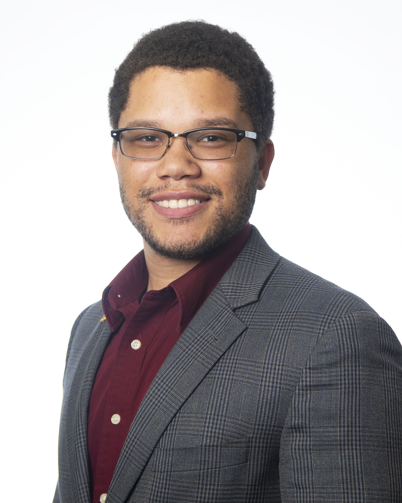

---
#
# By default, content added below the "---" mark will appear in the home page
# between the top bar and the list of recent posts.
# To change the home page layout, edit the _layouts/home.html file.
# See: https://jekyllrb.com/docs/themes/#overriding-theme-defaults
#
layout: home
---

# About me

  

  Hi!
  My name is Kevin Ingles, I am a theoretical physicist studying high energy
  phenomenology at The Ohio State University.
  My interest in theoretical physics was sparked by the fictional character Sheldon Cooper.
  Though, my research, unlike his, is closer to reality.
  In graduate school I have primarily been concerned with the phenomenology of Quantum
  Chromodynamics (QCD).
  I have studied topics such as quark-gluon plasmas and hadron spectroscopy.
  QCD is a very rich theory due to its non-Abelian nature.
  I am most interest in non-perturbative phenomena such as instantons and how
  these topological modes evolve and behave in various energy density regimes.

  My hope is to to become a tenured professor at a R2 university or liberal arts college,
  as my passion is largely in mentoring aspiring scientists.
  Mentoring and facilitating mentorship programs has been my second largest preoccupation
  during graduation school.
  This has primarily been through our organization 
  [Polaris](https://physics.osu.edu/student-organizations-0/polaris-0).
  I take outreach and Diversity, Equity, Inclusion and Access (DEIA) work very seriously,
  and will continue advocate for such initiatives until we see a paradigmatic shift
  in what individuals think a physicists look like.
  I also have great interest in understanding and developing leadership structures
  student driven organization which ensure their persistence past the inaugural cohort.
  

  

  {: width="220px"}
  

