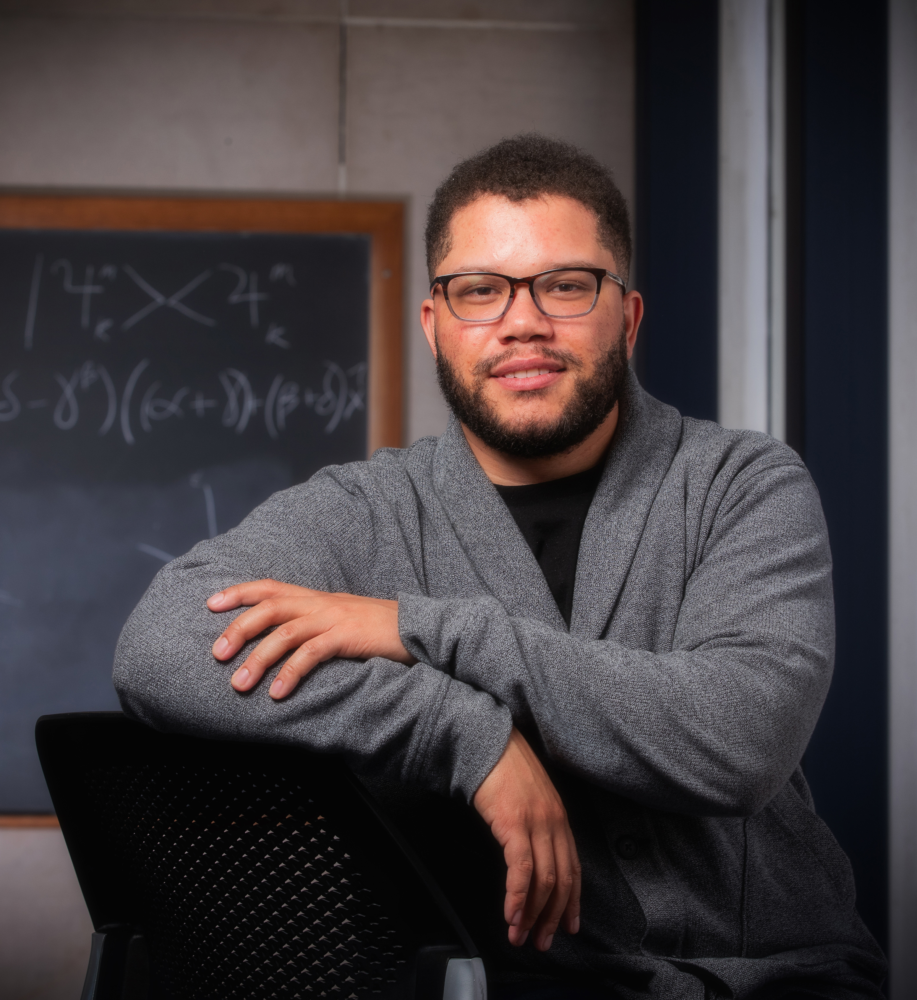

---
#
# By default, content added below the "---" mark will appear in the home page
# between the top bar and the list of recent posts.
# To change the home page layout, edit the _layouts/home.html file.
# See: https://jekyllrb.com/docs/themes/#overriding-theme-defaults
#
layout: home
title: Home
---

# About me

  

  I am currently a graduate student at The Ohio State University where I study theoretical particle physics.
  My primary research interest lies at understanding all the rich phemomena that result from a non-Abelian gauge theory.
  More than my passion for research and learning, I have a passion for mentoring and this passion sits at the core
  my wanting to become a college professor.
  Aside from academics, I also enjoy programming, weight-lifting, any encarnation manga and youtubing all night.
  

  

  {: width="220px"}
  

