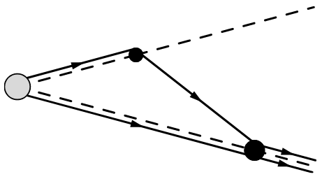
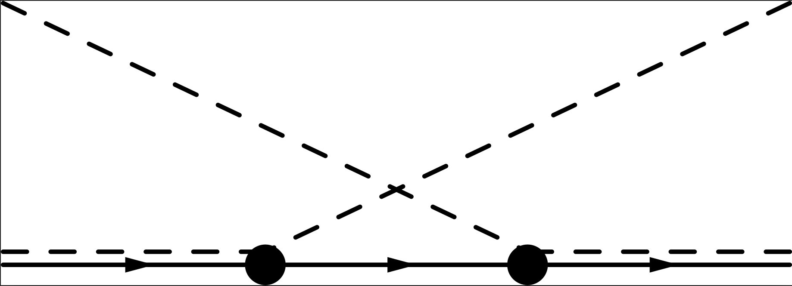



  Of fundamental interest to me are the phenomena described by Quantum Chromodynamics (QCD).
  I am particularly fascinated by emergent phenomena such as quark confinement, collective flow
  and superfluidity.
  Through my graduate education, I was able to explore a breadth of topics including effective
  field theories, relativistic hydrodynamics, and
  numerous models for heavy-ion collisions.
  For the next stage in my career, I want to combine and expand this knowledge to study the effects of large
  vorticity and strong magnetic fields on dense QCD matter.
  Such effects include spin polarization in a rotating quark gluon plasma, 
  as well as magnetic field generation and instabilities in neutron stars.
  The two frameworks I will use to address these topics are relativistic magnetohydrodynamics
  and topological fluid dynamics.
  
## Past Research Experience

  My research in particle theory has focused on the exotic hadrons $$X(3872)$$ and $$T_{cc}^+(3875)$$.
  My collaborators and I
  were the first to predict the narrow peak,
  just above the $$D^\ast D^\ast$$
  thresholds, in the production of 
  [$$X$$](https://doi.org/10.1103/PhysRevD.100.094006) or
  [$$T_{cc}^+$$](https://doi.org/10.1103/PhysRevD.106.034033)
  and a pion.
  This narrow peak is a particularly exquisite example of a triangle singularity, a type of
  dynamical singularity first discussed by Landau 1959,
  that should be observable in 
  [$$e^+e^-$$ collision](https://doi.org/10.1103/PhysRevD.100.031501),
  [$$pp$$ collisions](https://doi.org/10.1103/PhysRevD.100.094006) and
  [$$B$$ meson decays](https://doi.org/10.1103/PhysRevD.100.074028).
  The observation of this peak would give conclusive evidence for
  identifying these exotic hadron as loosely bound charm-meson molecules.
  Our work on triangle singularities has been very fruitful, resulting in six out of my eight publications in
  Physical Review D.

  

  {: width="250px"}

  Diagram for production of $$T_{cc}^+\pi$$. 
  The triangle singularity arises when the three lines that form a triangle
  are on-shell simultaneously.
  

  

  {: width="250px"}

  Diagram for the process $$\pi D^\ast \to \pi D^\ast$$.
  The $$t$$-channel singularity arises when the intermediate $$D$$ meson is on shell.
  

  An ongoing project is to understand the effects of pion interactions on charm mesons and
  loosely bound charm-meson molecules in heavy-ion collisions.
  The hope of this study is to account for the observed order-of-magnitude increase in the
  $$X(3872)$$-to-$$\psi(2S)$$ ratio in
  Pb-Pb relative to $$pp$$ collisions.
  We were the first 
  to recognize the importance of the $$t$$-channel singularity in charm-meson reaction
  after the kinetic freeze-out of a hadron gas produced in a heavy-ion collision.
  The singularity 
  [significantly changes the predicted ratio](https://arxiv.org/pdf/2209.04972)
  of observed spin-0 charm mesons, from
  the conventional predictions which assumes that there are no interactions after kinetic freeze-out.
  The details of this project will comprise the contents of my Ph. D. dissertation.
  
  My research in nuclear theory has primarily focused on addressing the poorly conditioned
  inverse problem for determining the hydrodynamic parameters from heavy-ion collider observables.
  There are four major formulations of viscous relativistic hydrodynamics 
  (MIS, DNMR, CE and VAH)
  in state-of-the-art hydro simulation.
  Each hydrodynamic formulation gives a slightly different set of values for the parameters 
  inferred from Bayesian analysis.
  My project is to develop Bayesian analysis tools that implement the ideas from Bayesian modeling
  average, mixing and selection.
  This would allow for the comparison of hydrodynamic formulations and more reliable quantification of the
  errors on the inferred parameters,
  which in turn contributes to the efforts to determine emergent properties of QCD matter.
  
## Future Research
  
  Projects that I want to work on moving forward include:
* Using Born-Oppenheimer theory to predict exotic hadronic bound states
* Study production of exotic hadrons in heavy-ion collisions
* Develop a magnetohydrodynamic description of quark-gluon plasmas
* Understand the evolution of spin in an expanding quark-gluon plasma
* Determine the equation of state and phase diagram for QCD
* Understand how magnetars generate their strong magnetic fields
* Contribute to the development of non-perturbative methods to study QCD

  Lastly, as a continuing side project, I am developing a high-enrgy experiment
  visualization software, that would allow users to watch interactive, 3D renderings
  of their simulations.
  My hope is that this tool can be used both for science communication, c.f.
  visualizations of black hole mergers, and as tool to drive experimental research
  design.
  My goal is to have VizQGP seemlessly interface with existing libraries such as
  [Geant4](https://geant4.web.cern.ch/) and [art](https://art.fnal.gov/).

